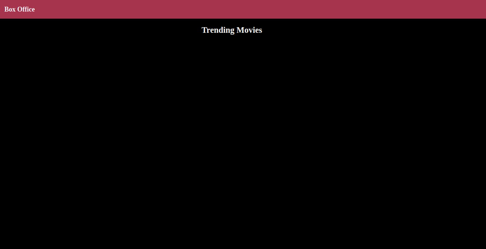
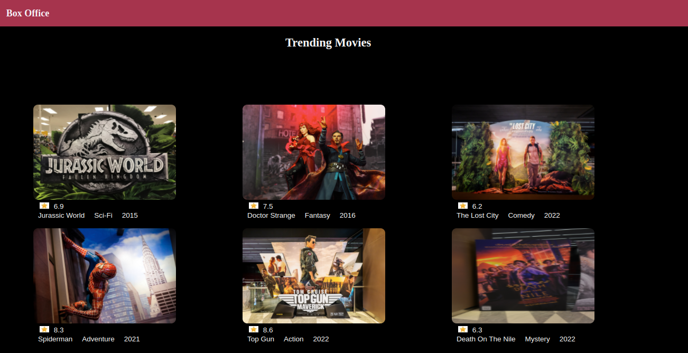
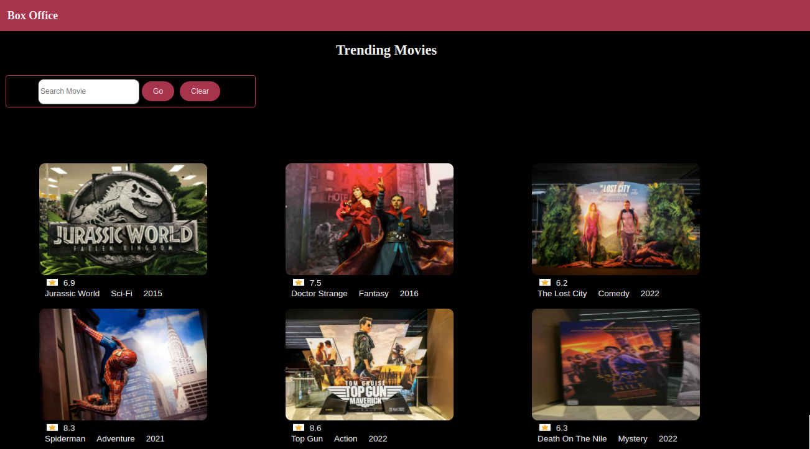

## Practice

This practice comprises of 3 exercises.

## Context

Box Office is a popular and authoritative source of movies and TV shows. One could find ratings and reviews for the newest movies and TV shows. ​

​Create a single-page application using Angular CLI that displays a list of trending movies attractively to the end users. Movie information like movie name, poster, genre, and ratings should be visible to the user. The users should be able to search for a movie from the list of movies displayed. 

### Problem Statements

#### Practice 1 - Create Components for Angular Box-Office App

- Create an Angular app named `Box-Office` using the Angular CLI command:​
                 `ng new --skip-tests box-office`​
- Create the identified components for the Box Office app.​
- To create a component, use the Angular CLI command.​
     `ng generate component <component-name>` or `ng g c <component-name>`​
- Render the component as mentioned below:​
    - `App` component should render `Header` and `Dashboard` components​
    - `Header` component should render the site name `Box Office`​
    - `Dashboard` component should display the title "Trending Movies" using text interpolation​.
- Below is the snapshot of the output expected.

#### Practice 2 - Display a List of Trending Movies

- Modify the `Box-Office` app code to design a view that displays the trending movies stored in the `movies.ts` file. ​
- Create a folder with the name `models` under the `app` folder of the `Box-Office` app. ​
- Copy the `movies.ts` and `movie.ts` files from the `resources` folder provided with the boilerplate code. ​
- The `MOVIES` array, defined in the `movies.ts` file under the `models` folder, stores the object of type `Movie.` The type `Movie` is defined in the `movie.ts` file. ​
- The dashboard view should be rendered by the `Dashboard` component that reads the movies from the `MOVIES` array and assigns them to the `movies` property of the component class. ​
- On the `Dashboard` template, iterate through the `movies` property using the `*ngFor` directive. ​
- For each iteration, the `movie` object traversed, the `Dashboard` component should render the `movie` object properties like a movie poster, rating, title, genre, and year of release using Angular text interpolation. ​
- Style the Dashboard component to present the movie list in a grid layout.
- Below is the snapshot of the output expected.

#### Practice 3 - Search Movies

- Modify the `Dashboard` component to add a search feature to the `Box-Office` app.​
- Declare `searchText` as a component property and bind it with the template using ngModel to capture the value when the user types in the search text box.​
- Add the `Go` button, which calls the component's search() method whenever the button is clicked using the event binding technique.​
       `<button (click) = "search()" type = button>Go</button>`​
- Similarly, add the `Reset` button to call the component's reset()  method to clear any typed text.​
       `<button (click) = "reset()" type = button>Reset</button>`​
- Write the search logic inside the search() method to filter the movies using the Array filter method.​
    - All movies should be displayed when the search text is empty.​
- Inside the reset() method, set the searchText value equal to an empty string and movies property value to the `MOVIES` array.​
- Below is the snapshot of the output expected:

